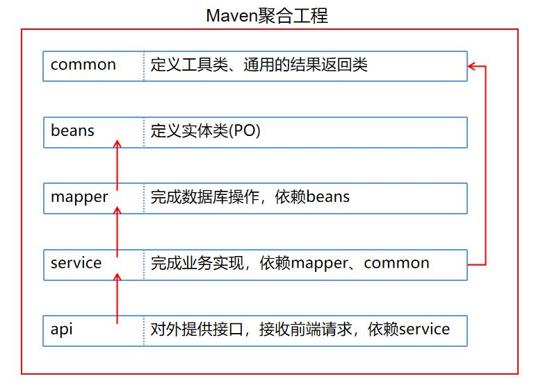

# 湖应商城
## 1. 项目介绍
&nbsp;&nbsp;&nbsp;&nbsp;&nbsp;&nbsp;&nbsp;“湖应商城”项目是一套前后端分离的电商系统，基于SpringBoot+MyBatis+Vue实现。 系统包含阿里云短信注册、登录、轮播图、商品推荐、分类推荐、商品搜索、商品展示、购物车、微信支付、个人中心、地址管理等模块。
## 2. 组织结构
### 2.1 前端结构  
>**mall-static**  
>├── html -- 页面  
>└── static -- 静态资源  
>  ├── css -- 层叠样式表  
>  ├── font、fonts --  字体格式  
>  ├── images、my -- 图片资源  
>  └── js -- 脚本文件  
>
>### 2.2 后端结构  
>
## 3. 技术栈
### 3.1 前端技术栈
| ***\*技术\**** | ***\*说明\**** |
| -------------- | -------------- |
| Vue            | 前端框架       |
| Element        | 前端UI框架     |
| Axios          | 前端HTTP框架   |
| layui          | Web UI 组件库  |
| Js-cookie      | cookie管理工具 |
| Nginx          | 静态资源服务器 |

### 3.2 后端技术栈
| ***\*技术\****  | ***\*说明\****    |
| --------------- | ----------------- |
| SpringBoot      | Web应用开发框架   |
| MyBatis         | 半ORM框架         |
| Ngrok           | 反向代理          |
| webSocket       | 消息推送          |
| quartz          | 定时任务框架      |
| mysql           | 关系型数据库      |
| Redis           | Key-Value型数据库 |
| Spring Cache    | 缓存框架          |
| JWT             | JWT登录支持       |
| tkMapper        | MyBatis插件       |
| Swagger-UI      | API文档生成工具   |
| logback-classic | 日志框架          |
| Linux           | 云部署环境        |
